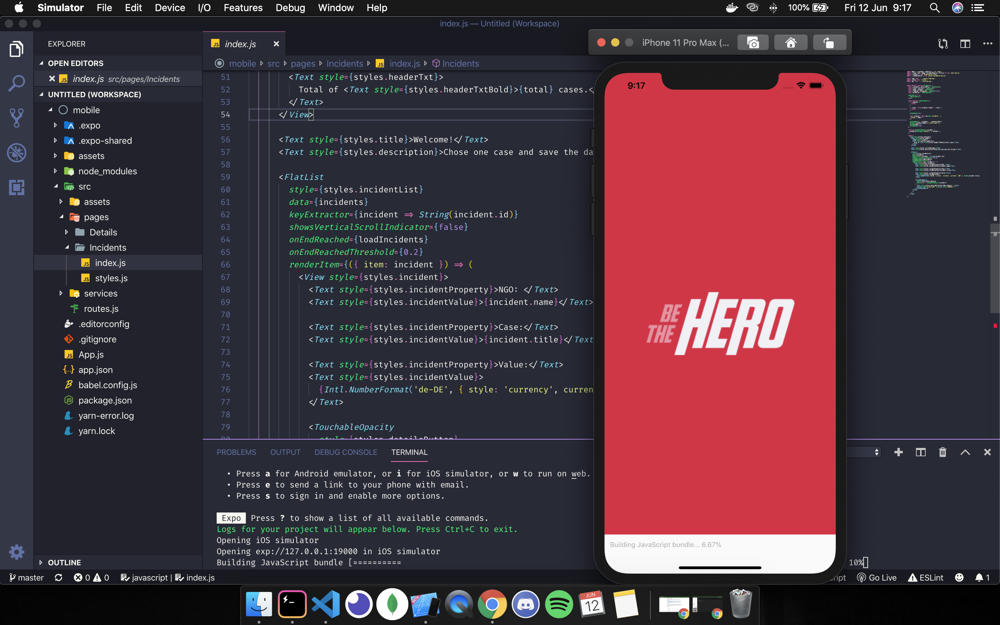

# Be-The-Hero-Mobile

This is the mobile part of the **Be-The-Hero** project developed by [**_Rocketseat_**](https://rocketseat.com.br/), a Brazilian company that teaches Node.JS, ReactJS and React Native.
This is a project where I could learn many professional techniques that is used in "the real world".

## About the project

- The **DevRadar** is an application where a Non-Governmental Organization can create a case in your session publishing a service that they did to ask some help as a payment.
- The **user** can access the app and contribute with a payment to some NGO for that specific service that the NGO has done.

## The mobile

The mobile was developed with [**_React Native_**](https://reactnative.dev/) using [**_Expo_**](https://expo.io/) and **Xcode** as a simulator.
[**_React Navigation_**](https://reactnavigation.org/) was used to handle the routes in this application. [**_MailComposer_**](https://docs.expo.io/versions/latest/sdk/mail-composer/) was used to handle the "email" button, sending the user to his/her email to contact the NGO and [**Linking**](https://reactnative.dev/docs/linking) to handle the button "WhatsApp", sending the user to his/her WhatsApp with the NGO contact already open to text them. 

**Loading...**

**Home**

**Case**

## Getting started

1.  Prerequisites

- npm

      npm install npm@latest -g

2. Installation

- Clone the repo

      git clone https://github.com/euguilhermegirardi/DevRadar-Mobile.git

3. Install NPM packages

       npm install

4. Run the application

       npm run start
    
5.**Note**: You have to run the [**_backend_**](https://github.com/euguilhermegirardi/Be-The-Hero-Backend) to run this application.

6. In localhost you can open-up the project by clickin on 'Run on...' iOS, Android or in the browser.

Obs. Attention on this part. You may have to change the 'baseURL' in the file 'src/services/api.js' if the app doesn't run at first.
Check the CONNECTION in the localhost in 'exp://...' on the left.

## Contributing

1.  Fork the project
2.  Create your feature branch (`git checkout -b feature/AmazingFeature`)
3.  Commit your changes (`git commit -m 'Add some AmazingFeature'`)
4.  Push to the branch (`git push origin feature/AmazingFeature`)
5.  Open a pull request

## License

